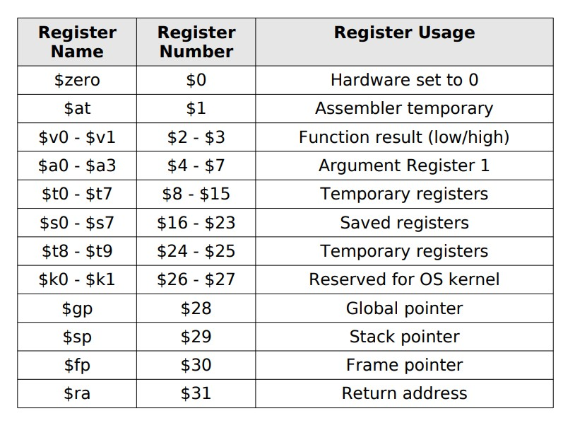

<center>
<h1>MIPS</h1>
</center>
MIPS is a RISC based architecture which works on "Load-Store" Strategy.
<br>
1. Data is loaded from the memory to the registers.
2. The control unit is executed.
3. The result is stored in the memory.
4. The program is terminated.
5. The next instruction is fetched and executed.

<br>

<center>
<h2>Instruction Set Architecture</h2>
</center>
The instruction set architecture of MIPS is 32-bit. It has 32 registers. The registers are divided into two parts:
1. General Purpose Registers
2. Special Purpose Registers

<br>

<center>
<h3>General Purpose Registers</h3>
</center>
The general purpose registers are used to store the data. The general purpose registers are divided into two parts:
1. 32-bit registers
2. 64-bit registers

<br>

<center>
<h4>32-bit Registers</h4>
</center>
The 32-bit registers are further divided into two parts:
1. 32-bit integer registers
2. 32-bit floating point registers

<br>

<center>
<h5>64-bit Registers</h5>
</center>
The 64-bit registers are further divided into two parts:
1. 64-bit integer registers
2. 64-bit floating point registers

<br>


Below is a list of all the registers in MIPS:



<br>

<center>
<h3>Special Purpose Registers</h3>
</center>
The special purpose registers are used to store the address of the next instruction to be executed. The special purpose registers are divided into two parts:
1. Program Counter
2. Stack Pointer

<br>

<center>
<h4>Program Counter</h4>
</center>
The program counter is used to store the address of the next instruction to be executed. The program counter is divided into two parts:
1. Program Counter Low
2. Program Counter High

<br>

<center>
<h5>Stack Pointer</h5>
</center>
The stack pointer is used to store the address of the top of the stack. The stack pointer is divided into two parts:
1. Stack Pointer Low
2. Stack Pointer High

<br>

<center>
<h2>Instruction Formats</h2>
</center>
The instructions in MIPS are divided into three formats:
1. R-Type
2. I-Type
3. J-Type

<br>

<!-- <center>
<h3>R-Type</h3>
</center>
The R-Type instructions are used to perform arithmetic operations. The R-Type instructions are divided into two parts:
1. Arithmetic Instructions
2. Logical Instructions

<br>

<center>
<h4>Arithmetic Instructions</h4>
</center>
The arithmetic instructions are used to perform arithmetic operations. The arithmetic instructions are divided into two parts:
1. Add
2. Subtract

<br>

<center>
<h5>Logical Instructions</h5>
</center>
The logical instructions are used to perform logical operations. The logical instructions are divided into two parts:
1. AND
2. OR

<br>

<center>
<h3>I-Type</h3>
</center>
The I-Type instructions are used to perform arithmetic operations. The I-Type instructions are divided into two parts:
1. Arithmetic Instructions
2. Logical Instructions

<br>

<center>
<h4>Arithmetic Instructions</h4>
</center>
The arithmetic instructions are used to perform arithmetic operations. The arithmetic instructions are divided into two parts:
1. Add
2. Subtract

<br>

<center>
<h5>Logical Instructions</h5>
</center>

The logical instructions are used to perform logical operations. The logical instructions are divided into two parts:
1. AND
2. OR

<br>

<center>
<h3>J-Type</h3>
</center>
The J-Type instructions are used to perform arithmetic operations. The J-Type instructions are divided into two parts:
1. Arithmetic Instructions
2. Logical Instructions

<br>

<center>
<h4>Arithmetic Instructions</h4>
</center>

The arithmetic instructions are used to perform arithmetic operations. The arithmetic instructions are divided into two parts:
1. Add
2. Subtract

<br>

<center>
<h5>Logical Instructions</h5>
</center>
The logical instructions are used to perform logical operations. The logical instructions are divided into two parts:
1. AND
2. OR

<br>

<center>
<h2>Instruction Set</h2>
</center>
The instruction set of MIPS is divided into two parts:
1. Arithmetic Instructions
2. Logical Instructions

<br>

<center>
<h3>Arithmetic Instructions</h3>
</center>
The arithmetic instructions are used to perform arithmetic operations. The arithmetic instructions are divided into two parts:
1. Add
2. Subtract -->


1. To add two numbers, we use the add instruction.

Example: 
```assembly
add $t0, $t1, $t2
```
This instruction adds the contents of $t1 and $t2 and stores the result in $t0.

<br>

2. To subtract two numbers, we use the sub instruction.

Example: 
```assembly
sub $t0, $t1, $t2
```

This instruction subtracts the contents of $t1 and $t2 and stores the result in $t0.

<br>

3. To multiply two numbers, we use the mul instruction.

Example: 
```assembly
mul $t0, $t1, $t2
```

This instruction multiplies the contents of $t1 and $t2 and stores the result in $t0.

<br>

4. To divide two numbers, we use the div instruction.

Example: 
```assembly
div $t0, $t1, $t2
```

This instruction divides the contents of $t1 and $t2 and stores the result in $t0.

<br>

<!-- 5. To perform bitwise AND operation, we use the and instruction.

Example: 
```assembly
and $t0, $t1, $t2
```

This instruction performs bitwise AND operation on the contents of $t1 and $t2 and stores the result in $t0.

<br>

6. To perform bitwise OR operation, we use the or instruction.

Example: 
```assembly
or $t0, $t1, $t2
```

This instruction performs bitwise OR operation on the contents of $t1 and $t2 and stores the result in $t0.

<br> -->
